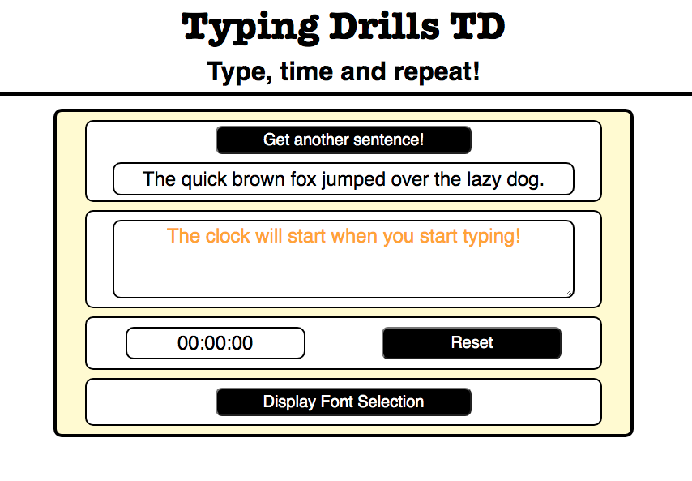
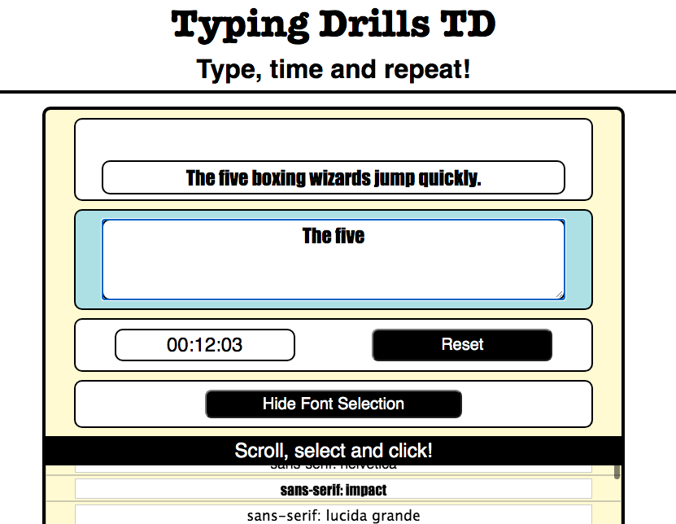
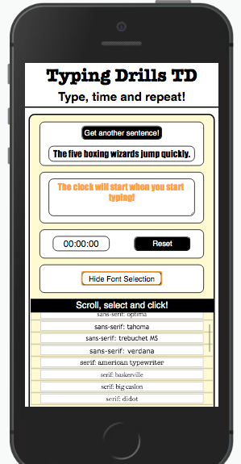

# Typing Drills

This tool is for helping people to practise their typing skills.

## Features:
* The user can replace the text sample to a randomly selected one.
* The user can change the text font-family.
* Timer and reset functions.

---
## Build with:
* JavaScript
* CSS
* HTML
---
## App Image: Starting Image.

---
## App Image: In-use Image.

---
## App Image: Responsive Example.

